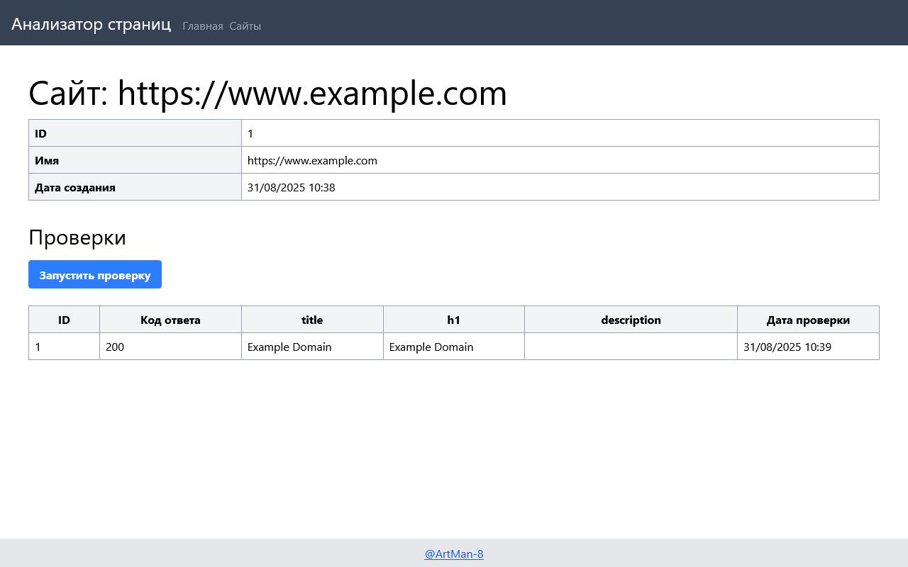

### Hexlet tests and linter status:

[](https://github.com/ArtMan-8/java-project-72/actions) [](https://sonarcloud.io/summary/new_code?id=ArtMan-8_java-project-72)

<hr />

# Анализатор страниц

Веб-приложение для анализа веб-страниц. Позволяет добавлять URL-адреса и получать краткую SEO информацию о них.

### Запуск локально

```sh
make run
```

Проект будет доступен по http://localhost:7000/

### Посмотреть онлайн

[java-page-analyzer](https://artman-8-java-project-72-5199.twc1.net/)


# Функциональность проекта

### Основная страница
На основной странице происходит ввод адресса сайта, для добавления в базу проверок.


### Страницы сайтов
Страница содержит список добавленных сайтов и результаты последних проверок.


### Страница сайта
Страница содержит информацию о проверках конкретного сайта.

